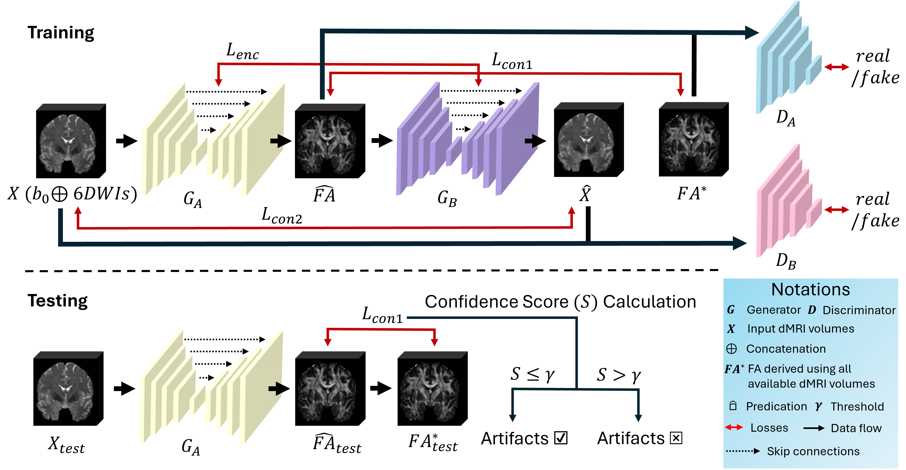

# UdAD-AC

Official PyTorch implementation of UdAD-AC: Unsupervised artifacts detection in dMRI data via angular resolution enhancement and cycle consistency learning




## Dependencies

* Python == 3.10

*Pytorch version*
* torch == 2.0

## Data

**Please refer to the official website (or project repo) for license and terms of usage.**
**Some preprocessing have been applied to the original data before feeding into our data loader. Please find the details in our paper.**

**HPC**

- Official Website: https://www.humanconnectome.org/


**Train**
Please refer to the training script in the scripts folder
```
python3 /home/sheng/UdAD/train.py \
--dataroot /home/jack/data/HCP/ \
--checkpoints_dir /home/sheng/UdAD/checkpoints \
--name hcpUdAD_100 \
--dataset_mode hcpUAD \
--num_threads 1 \
--batch_size 1 \
--input_patch_size -1 \
--data_norm instance_norm_3D \
--model UdAD \
--input_nc 7  \
--output_nc 1  \
--output_nc2 2  \
--cnum 8 \
--n_epochs 100 \
--n_epochs_decay 0 \
--save_epoch_freq 5 \
--gpu_ids 0
```

**Test**
Please refer to the testing script in the scripts folder
```
python3 /home/sheng/UdAD/test.py \
--dataroot /home/jack/data/HCP/ \
--checkpoints_dir /home/sheng/UdAD/checkpoints \
--results_dir /home/sheng/UdAD/results \
--eval \
--name hcpUdAD_100 \
--epoch latest \
--dataset_mode hcpUAD \
--num_threads 0 \
--serial_batches \
--batch_size 1 \
--input_patch_size -1 \
--data_norm instance_norm_3D \
--model UdAD \
--input_nc 7 \
--output_nc 1 \
--cnum 8 \
--num_test 50 \
--save_prediction 1 \
--gpu_ids 1
```

<!-- Our code framework heavily brought from [CycleGAN](https://github.com/junyanz/pytorch-CycleGAN-and-pix2pix). We appreciate the authors for their contributions on a great open-source framework of deep adversarial learning! -->